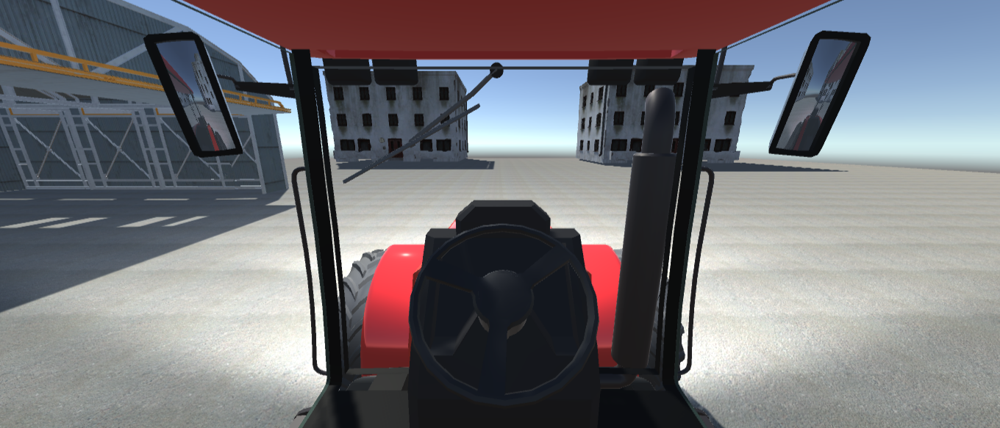

# Симулятор тракториста
Программое решение является desktop приложением для тренировки водителей сельскохозяйственной техники элементам парковки и сцепки с прицепным механизмом. Целью проекта является сокращение затрачиваемого времени на проведение операции сцепки. Цель достигается повышением навыков управления техникой при отработке операции в виртуальном тренажере.  Игровой симулятор состоит из 4 уровней с различными условиями для парковки. Для успешного прохождения задачи необходимо проехать по локации с прицепом и припарковаться в заданной точке (отмечена подсвечиваемым кубом)

 ### <b>Описание уровней</b>
  

<b>• Уровень 1.</b> Открытое пространство являющееся полем с засеянными культурами

   
    
   Зона парковки около фермы
 

   
<b>• Уровень 2.</b> Лабиринт, где путем является дорога между кирпичных домов

   

   
    
   Дорога между домов 
 

 
<b>• Уровень 3.</b> Лесная зона с труднопроходимыми

  

   
    
   Лесополоса с ухабами
 

  
<b>• Уровень 4.</b> Промышленная зона. Открытое пространство, где находятся служебные здания и открытый ангар

  

   
    
   Промзона с ангаром для парковки
 

  
  ### <b>Интерактивные комплектующие трактора</b>
   - Фары. При нажатие клавиши *E* излучают теплый свет спереди и красный сзади на стопорных огнях
   
   

   
    
   передние габаритные огни
 

 
   - Руль. Нажатие на левую или правую стрелку поворачивает руль по или против оси
   

   
    
   руль (вид от 1 лица внутри кабины)
 

  
   - Дворники. Запуск вращения щеток лобового и заднего стекла осуществляется по нажатию на клавишу *R*
   

   
    
   Дворники лобового стекла
 

 
   - Прицеп. Фиксируется двумя joint'ами для перемещения вслед за трактором с возможностью вращений по двум осям.
 

   
    
   Трактор с прицепом
 

  
## Стек технологий:

***Движок:*** Unity

***Язык программирования:*** C#

## Автор
#### [pacan164 (github.com)](https://github.com/pacan164)